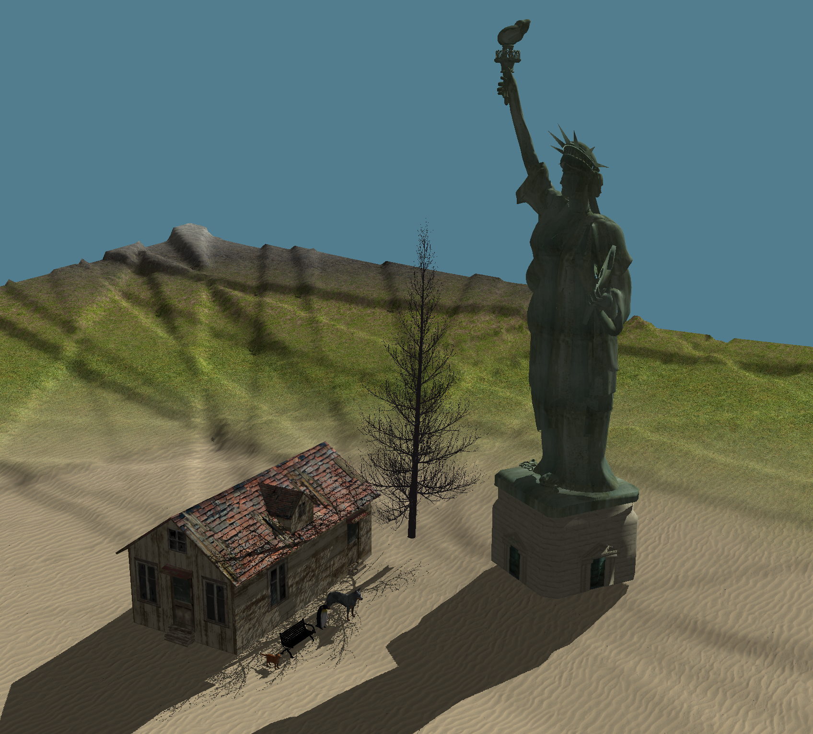
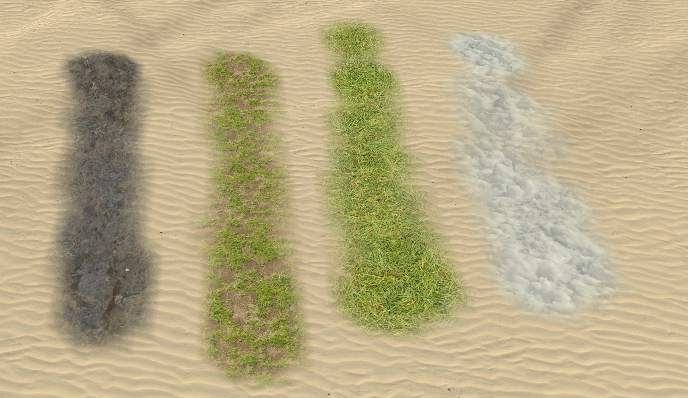
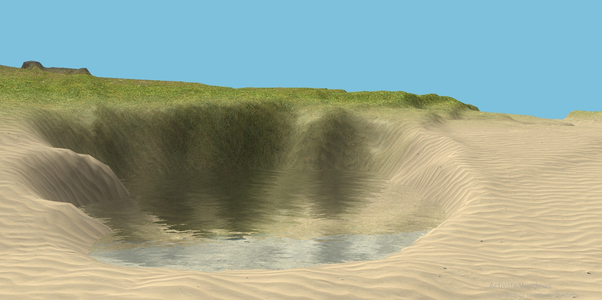

# Interactive World Building Game

## Abstract

Our project is a world builder game in which the player has a modifiable terrain (digging, elevating, and flattening). The player can paint terrain with textures (snow, dirt, grass), place objects (cottage house, cat, dog), and experience a realistic day/night cycle with shadows.  
➡️ [GitHub Project Link](https://github.com/ErayOnder/TerrainDemo)

---

## Features

- **Procedural Terrain System**

  - 250x250 grid with heightmaps (flat, volcanic, crater, fault)
  - Real-time digging, raising, flattening, painting  
    

- **Camera System**

  - Perspective projection, movement, rotation
  - Rodrigues’s formula for pitch to avoid gimbal lock

- **Dynamic Lighting**

  - Continuous day/night cycle
  - Celestial simulation with sun/moon movement
  - Blinn-Phong shading

- **Shadows**

  - Two-pass shadow mapping (depth-buffer based)
  - Dynamic bias to reduce artifacts  
    

- **Water Rendering**

  - Reflection & refraction with DuDv & normal maps
  - Fresnel blending for realism  
    

- **Object Management**

  - Object loading via Assimp
  - Transformations (translation, rotation, scaling)
  - Factory pattern for centralized object setup

- **UI System**

  - Lightweight UI with buttons and dropdown menus
  - Cascading dropdown animation

- **Raycasting**
  - Cursor-to-grid intersection for terrain manipulation & object placement

---

## Technical Details

- **Language:** C++
- **Graphics API:** OpenGL
- **Libraries:** GLFW, GLAD, Assimp, SFML
- **Build System:** CMake

---

## Demo

- Day & Night Cycle 🌞🌙
- Terrain manipulation (dig/flatten/paint)
- Shadow mapping
- Water reflections & refractions

---

## Team

- Tuna Çimen
- Ahmet Neçirvan Doğan
- Eray Önder
- Ada Yıldız

---

## Conclusion

This project culminated in the creation of a feature-rich interactive sandbox game that demonstrates key computer graphics concepts: procedural terrain generation, lighting, shadows, water rendering, raycasting, and UI/audio integration.
